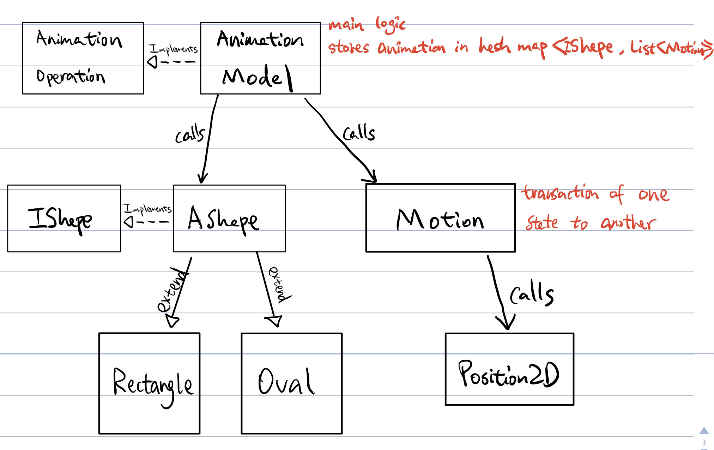

# OODHw5
This is a pictorial description of the animation model that we are trying to build.

The main logic of this model will be handled in Animation Model class. This class can create a shape, remove a shape, add motions to a shape, check if a listOfMotion is valid, and convert current animation to strings. Animation model will implement its interface called Animation Operation class.

The shapes that user will create is controlled by an abtract shape class called AShape. This class will handle the field storing of each shape. Since the guide only provided two shapes oval and rectangle (both represented by width and height) we are storing those parameters in the abstract class. The individual shape classes ("Oval" and "Rectangle") extends the abstract class and will only be used upon creation, giving the shape an identity of either being an oval or a rectangle.

We define motion as a transaction of state from one time to another. The transition of state means the motion will store the starting states and ending states. The starting states include: starting time, width, height, position, color. The ending states include: ending time, width, height, position, color. 

We utilized 2 map data structures in Animation Model to store and access the animation. The first hash map is nameMap. It is used to find the shapes linked to its custom name. 

